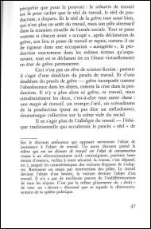
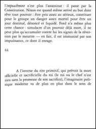
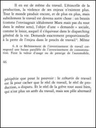
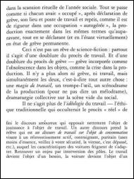
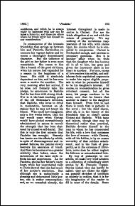
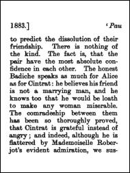
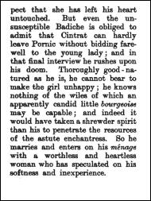
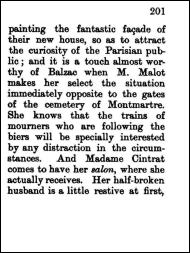
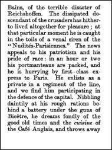

<a href="https://paypal.me/benckx/2">

</a>

# About

Some PDFs books found online are usually poorly rendered on small e-readers (e.g. Kindle Oasis).

This lib uses OCR to correct the angle, crop around the text and re-paginate in order for the best reading experience on
small e-readers.

## Examples

### Example 1

#### Input

<p float="left">
    
    
    
    
</p>

#### Output

<p float="left">
    
    
    
    
    
    
</p>

### Example 2

#### Input

<p float="left">
    
    
    
    
</p>

#### Output

<p float="left">
    
    
    
    
    
    
    
    
    
    
    
    
    
    
    
    
    
    
    
    
    
    
    
    
    
    
    
</p>

# Requirements

```shell
sudo apt-get install tesseract-ocr
```

# Usage

```java
        RequestConfig requestConfig = RequestConfig
            .builder()
            .pdfFile(file)
            .minPage(minPage)
            .maxPage(maxPage)
            .correctAngle(true)
            .build();

        Processor processor=new Processor(requestConfig);
        processor.process();
        processor.joinThread();
        File outputFile=processor.writeToPDFFile(fileName+"optimized.pdf");
```

# TODO

* Move to Gradle
* Move to Kotlin
* Finish picture detection
* Create a user-friendly runnable
* Re-add tests
