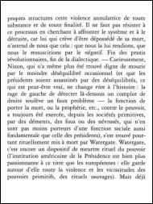
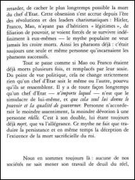
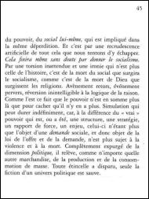
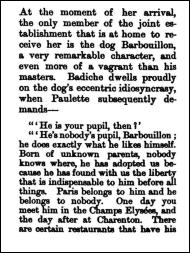
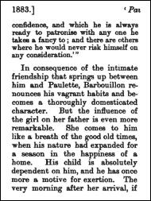
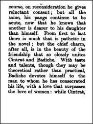
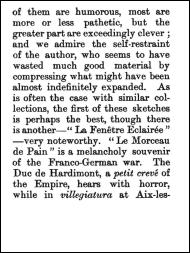
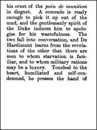
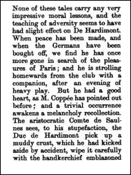
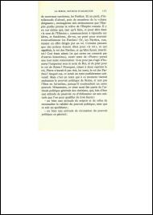

<a href="https://paypal.me/benckx/2">

</a>

# About

PDF books and articles found online are usually poorly rendered on small e-readers (e.g. Kindle Oasis).

This lib uses OCR to correct the skewed angle of the page, crop around the text and re-paginate; as to optimize
for the best reading experience on small e-readers.

The code was initially written in 2018, along with an online converter website that I decided to take down as it would
cost quite a bit (OCR and image processing being quite resource-intensive). I also couldn't maintain it as I was working
full time.

Therefore, the project probably needs a bit of a cleanup.

The unit tests using full PDF books can not be shared publicly.

## Examples

### Example 1

#### Input

<p float="left">
    
    
    
    
</p>

[download PDF](thumbs/baudrillard_extract.pdf)

#### Output

<p float="left">
    
    
    
    
    
    
    
</p>

[download PDF](thumbs/baudrillard_output.pdf)

### Example 2

#### Input

<p float="left">
    
    
    
    
</p>

[download PDF](thumbs/edinburgh_extract.pdf)

#### Output

<p float="left">
    
    
    
    
    
    
    
    
    
    
    
    
    
    
    
    
    
    
    
    
    
    
    
    
</p>

[download PDF](thumbs/edinburgh_output.pdf)

### Example 3

#### Input

<p float="left">
    
    
    
    
</p>

[download PDF](thumbs/ellul_extract.pdf)

#### Output

<p float="left">
    
    
    
    
    
    
</p>

[download PDF](thumbs/ellul_output.pdf)

# Requirements

```shell
sudo apt-get install tesseract-ocr
```

The data in `tessdata/` is found on https://github.com/tesseract-ocr/tessdata_best

# Usage

```java
    RequestConfig requestConfig = RequestConfig
        .builder()
        .pdfFile(file)
        .minPage(minPage)
        .maxPage(maxPage)
        .correctAngle(true)
        .build();

    Processor processor = new Processor(requestConfig);
    processor.process();
    processor.joinThread();
    File outputFile = processor.writeToPDFFile(fileName + "_optimized.pdf");
```

# TODO

* ~~Move to Gradle~~
* Re-add unit tests that can be shared publicly, adapt the other ones
* Create a user-friendly runnable
* Move to Kotlin
* Finish picture detection
